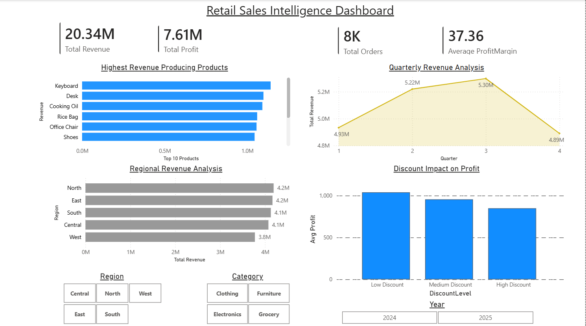
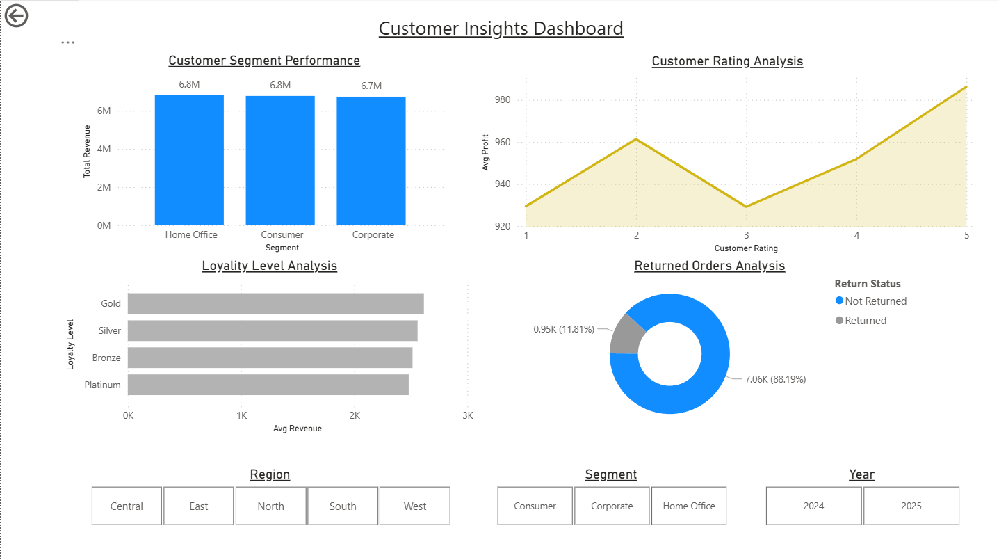
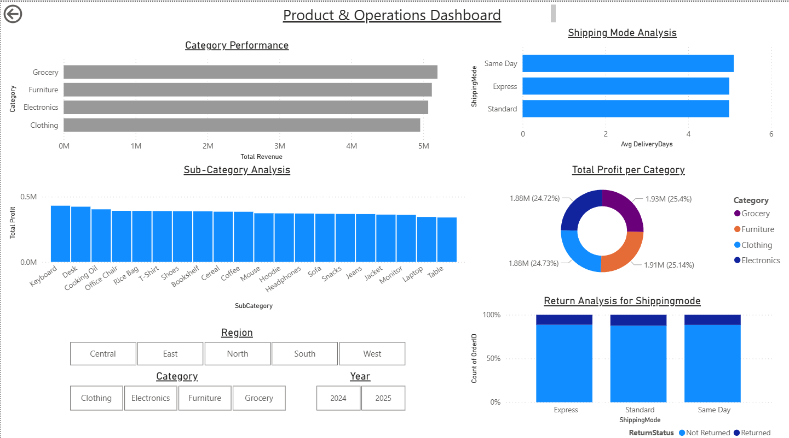

# Retail Sales Analytics

A portfolio case study using **Python, SQL Server, and Power BI** to explore sales, profit, customer segments, products, and shipping. The project includes a reproducible Python analysis script, a three-page Power BI report, and dashboard previews.

> **Data note:** The 8,000 retail orders are **synthetic**. `Retail_sales_analysis.py` generates them with fixed random seeds, introduces selected missing values, cleans the data, and exports `Retail_sales_cleaned.csv`. The results illustrate an analytics workflow; they do not represent a real retailer or production business decisions.

## Preview

| Executive overview | Customer insights | Products and operations |
| --- | --- | --- |
|  |  |  |

Open [the Power BI report](Retail_sales_Analytics_dashboard.pbix) in Power BI Desktop to explore the pages interactively.

## Questions explored

- How do revenue and profit vary by region, product, and customer segment?
- How do results change by month, quarter, discount level, and shipping mode?
- Which metrics should appear on an executive dashboard?

The Python script computes revenue, profit, order count, average order value, and profit margin. It also creates time features and discount bands, checks duplicates and outliers, and produces exploratory charts. Because the data is randomly generated, treat apparent differences between groups as examples to investigate rather than causal findings.

## Repository guide

| File | Purpose |
| --- | --- |
| [Retail_sales_analysis.py](Retail_sales_analysis.py) | Generate, clean, explore, and export synthetic order data |
| [Retail_sales_cleaned.csv](Retail_sales_cleaned.csv) | Export used for analysis and the dashboard |
| [analysis_queries.sql](analysis_queries.sql) | Runnable example SQL Server analysis queries |
| [retail_sales_queries.sql](retail_sales_queries.sql) | Saved SQL Server **results/output**, not executable SQL |
| [Retail_sales_Analytics_dashboard.pbix](Retail_sales_Analytics_dashboard.pbix) | Power BI dashboard |

## Reproduce the analysis

1. Install Python 3 and the packages `pandas`, `numpy`, and `matplotlib`.
2. Run `python Retail_sales_analysis.py` from the repository directory. The script writes a generated dataset and `Retail_sales_cleaned.csv` to the current directory and opens Matplotlib charts.
3. To use the SQL examples, import the cleaned CSV into SQL Server as a table named `dbo.RetailSales`. Use suitable date and numeric column types, then run [analysis_queries.sql](analysis_queries.sql). Change the table name in the queries if yours differs.
4. Open the PBIX in Power BI Desktop. If the report references a local data path, point it to the CSV in your checkout and refresh.

## Skills shown

Python, pandas, data cleaning, exploratory analysis, KPI definition, SQL Server aggregation, and Power BI storytelling. This is a local analytics case study; it does not include an automated production data pipeline.
